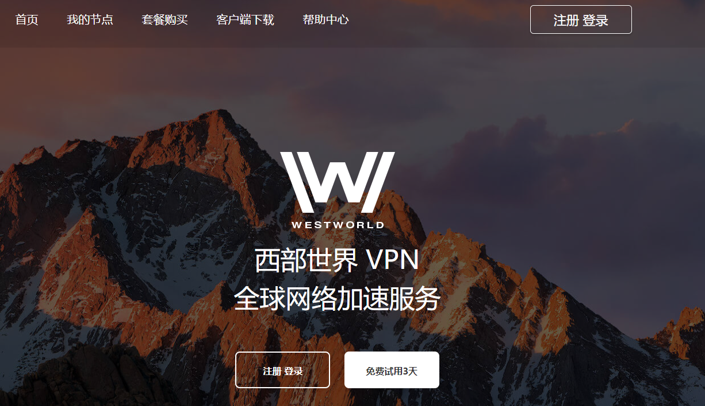
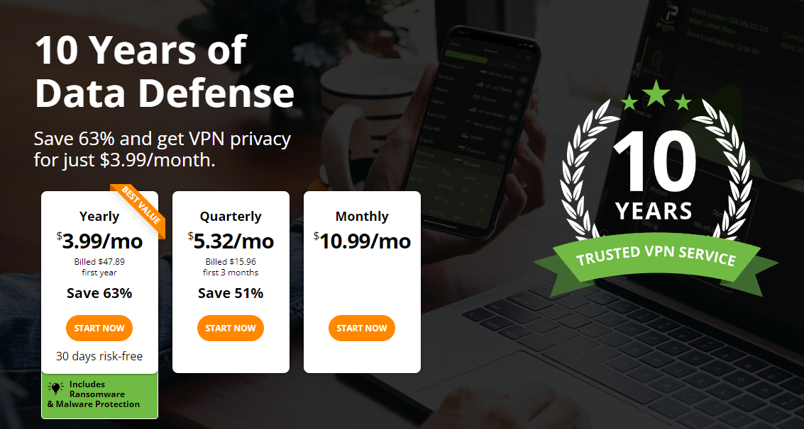
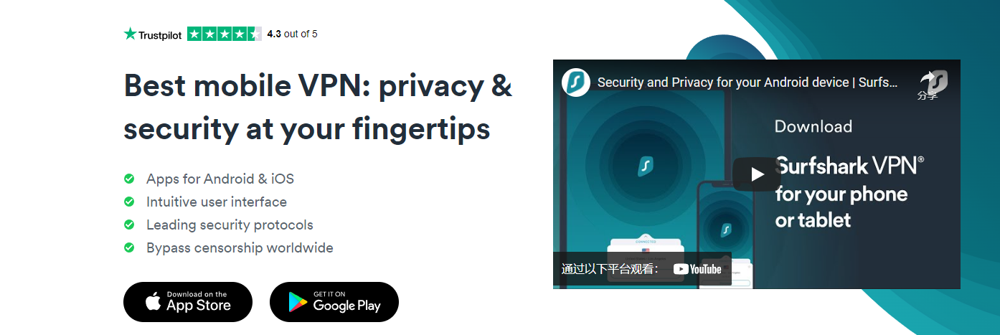
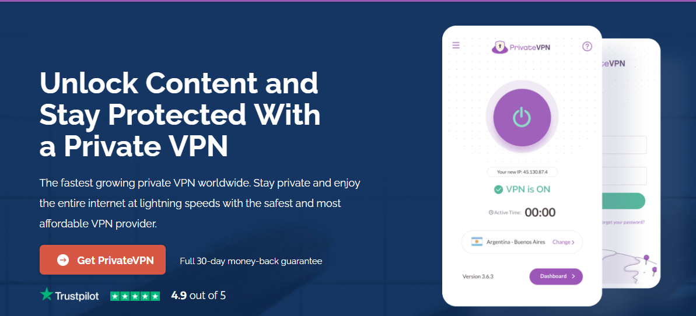

# 【免费试用】推荐五个VPN，老牌稳定，支持电脑苹果手机安卓挂梯子

**推荐五款老牌稳定的VPN梯子工具，每一个都有超长时间的免费试用，并且还有白嫖的机会。同时支持pc电脑，苹果手机，安卓手机，路由器等设备。**

众所周知，随着“墙”的不断升级，造成很多梯子软件都时灵时不灵，在这种环境下，稳定才是王道，所以我选梯子软件，基本都是以老牌子优先，经过市场和时间的洗礼没有被淘汰的。

这五款可以免费试用的梯子软件，不但支持电脑手机等客户端，而且运营时间也足够长，口碑风评都不差，协议也在不停升级，由原先的ssr节点到后来的V2ray和Trojan节点，带来的结果就是扛封锁能力不断增强。

### 一、Westworld---免费试用三天，有白嫖方法，目前正在用的主力梯子

#### 官网地址：[https://xbsj4621.fun/i/art072](https://xbsj4621.fun/i/art072)

如果一定要选一款我自己用的最顺手的梯子，那肯定非Westworld莫属。不仅支持windows电脑，苹果手机，安卓手机，路由器等多设备同时登陆，而且在刷视频和外服游戏加速方面，也有很强的优势，概括来说，就是水陆空多栖发展。

Westworld最大的优势是后台所有线路都是IEPL专线，很多小伙伴可能对“IEPL专线”没有概念，不理解也没关系，只要清楚，这个线路节点，几乎可以和高速、稳定划等号。也就说别人挤公交大巴的时候，你坐的特快专线。

其实这些年我陆续更换过的梯子软件也不少，只有极少数能让我长期使用，而Westworld梯子我到目前为止已经用了一年多了，平时不管刷Netflix，youtube还是发邮件，查资料，又或者是打打外服游戏，这款梯子软件都能全方位超预期的满足需求。

Westworld梯子后台节点数量众多，有一百多条可以选择，覆盖全球绝大数区域，并且是全程无日志运营，不会记录用户的任何使用数据。

对于新注册的用户，有三天不限流不限速的超长免费试用时间，极大限度降低了试错成本。

永久免费方案：

因为Westworld注册阶段是通过邮箱注册，接收验证码后才有三天免费时间，所以大家可以网上搜索关键词“临时邮箱”，通过临时邮箱去注册并且接收验证码，从而不断获取三天免费使用的账号，达到永久白嫖的效果。

备注：因为针对试用的账户，后台只有三条免费试用的节点，所以用来发邮件，查资料，看视频是毫无问题的，但是要解锁Netflix以及打外服游戏，还是得用他们的付费节点。

### 二、CyberGost

这款梯子软件算是我的“初恋”，但大家都知道，初恋总是走不到最后的，因为随着眼界的开阔大概率会出现更好的。

CyberGost也是支持windows，ios，Andriod，路由器等多设备使用的，但我用下来的感受，速度总感觉差点意思，具体点说，就是看Youtube偶尔会卡顿一两下，可能是我喜欢看1080P清晰度的缘故，后来我调720P，卡顿的情况就没有出现过。

这款梯子的免费试用是支持24小时的，虽然时间不长，但也绝不算短，在全球部署了6900台服务器，并且也是不记录任何用户使用数据。

### 三、Ipvanish

这款梯子软件我对它的评价是为“翻墙”而生的，成立时间也很早，网上关于它的消息最早可以追溯到2018年，并且总部是位于北美的，在全球部署了4000多台的服务器。

美中不足的是，Ipvanish网站采用的是全英文描述，对于英语基础不好的小伙伴，可能啃下来有点吃力，但所幸翻墙梯子软件在功能性方面一向都是极简化主义，弄来弄去就那么几个按钮，所以真到用的时候，难度并没有那么大。

这款电脑和手机两用的梯子最大特点是采用了ECC加密技术，可以最大限度的保护用户隐私不被泄露。

### 四、Surfshak

这个梯子在业界一直都是很稳定的存在，多年的技术沉淀，积累了足够多的应对突发状况的经验，所以每每出现问题，不管是墙的升级还是其他特殊状况，都能在最短时间内恢复运作，保护用户的使用体验。

如果你用的是安卓手机，并且想在安卓系统当中有一个方便快捷的翻墙体验，那么除了最开始的Westworld外，我唯一推荐的就是它。

当然，它所支持的操作系统绝不仅限于安卓，包括pc电脑，苹果ipad平板电脑，ios苹果手机，都是可以使用的，虽然价格上来说不是很便宜，但是对价格不敏感的用户，这个梯子也是一个很不错的选择。

### 五、Private

从名字就可以看出来，这个梯子软件最注重的，就是对用户隐私的保护，在加密性和安全性方面做的尤为出众，出众到有些技术，我都是未曾听说过的。

但不得不说，它的忠实粉丝也确实多，我曾经在不下两个朋友口中，听到他们推荐这个梯子软件。而且这些年Private也在不断扩大它的服务器网络，对服务器性能的升级和扩大覆盖地区的范围也从未停步。

在使用上，支持一键安装一键翻墙的准则，只需要几个步骤就能下载安装官方客户端，并且连接后就能科学上网。

**以上几款梯子软件都是经过时间洗礼的老牌梯子，并且也都支持安卓，苹果手机，pc电脑，路由器等多客户端科学上网，如果你工作生活当中确实需要一个又快又稳定的梯子软件，任选其一，总有一款适合你。**
